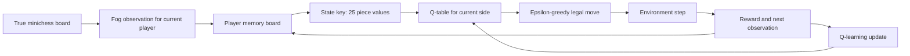

# Fog of War Mini-Chess 

Fog of war is a variant of chess where each player can only see their own pieces, and squares where their own pieces can move to (including by capturing). This turns chess from a perfect to an imperfect information game. Mini-chess is a further variant of chess where the board is smaller: 5x5 instead of 8x8, and fewer pieces are used. We will use this variant because we hope it will make the game easier to learn for a reinforcement learning agent. We call the combination of both variants Fog of War Mini-Chess .

```
k q b n r
p p p p p
. . . . .
P P P P P
K Q B N R
```

## The State Space 

The board in chess can be represented as a matrix with an enum value at each cell representing a piece (king, queen, rook, knight, bishop, pawn), and empty. The state space can be a square matrix, where in each square an enum index is included. There is an enum index for each type of piece in each team, for empty squares, and for unknown squares. We can also represent the state in an unstructured way. Instead of a matrix, we have a set of squares. Each square is a tuple containing the location and kind of piece. The location can be represented by the row and column, or by an index. Additionally, this tuple could contain the turn number. This would allow us to represent the current state with a set of all historic revealed pieces, and the set of unknown pieces in the latest turn. For example: s = (t, p, k) t is the turn p is an enum with the square position k is an enum with the kind of piece / empty / unknown our full state representation is a set of s: {s0, s1, s2, …} 

## The Action Space 

We can represent the action space as a set of legal state transitions. Each transition is represented by a tuple containing the location of the piece to move, and the location of the destination. By using a set, we can always easily represent all the legal actions the agent can take, and they can be transformed with an attention mechanism into probabilities. 

# Setup

```
conda create -n fog_chess python=3.12
conda activate fog_chess
pip install -r requirements.txt
```

## File structure

```
fog_chess/
├── fog_chess/
│   ├── chess.py      # Minichess rules, fog observations, rewards, environment step
│   ├── rl.py         # Memory-based tabular Q-learning training and evaluation
│   ├── app.py        # Streamlit UI for playing against the trained model
│   ├── human.py      # Terminal two-player helper and move parsing
│   ├── visual.py     # Matplotlib board visualization helper
│   └── __init__.py
├── logs/             # Training logs
├── models/           # Saved Q-table checkpoints
├── notebooks/        # Interactive notebooks
├── requirements.txt
└── README.md
```

# Train and play

Train a fog-observation Q-learning model:

```
python -m fog_chess.rl --episodes 5000 --seed 7 --report-every 100 --eval-games 300 --log-file logs/fog_q_learning5000.log --model-file models/fog_q_learning.json
```

The Q-learning state uses each player's memory board: visible squares update the
memory, and hidden squares keep the last remembered piece or empty square.

## Algorithm summary



- We train two tabular Q-learning agents by self-play: one Q-table for White and
  one Q-table for Black.
- The game is imperfect-information minichess. The agent does not receive the
  full board; it receives a fog observation.
- The state is a memory board, not just the current observation. Visible squares
  overwrite memory; hidden squares keep their last known value.
- The true board is still used by the environment to check legal moves,
  captures, checkmate, and draws.
- Action selection is epsilon-greedy over legal moves only.
- During training, the best checkpoint is selected by evaluation against random
  opponents.

Key equations:

```
memory_t[square] =
    observation_t[square], if visible
    memory_{t-1}[square],  if hidden
```

```
Q(s, a) <- Q(s, a) + alpha * (reward + gamma * max_a' Q(s', a') - Q(s, a))
```

```
alpha:   0.20 -> 0.05
epsilon: 0.40 -> 0.05
gamma:   0.95
```

Reward:

```
capture normal piece = piece_value / 100
promotion            = +5
checkmate            = +500
king capture         = +500
draw                 = 0
```

# Current results

Current run: `logs/fog_q_learning5000.log`, through episode `3900`.

```
self_play white_win / black_win / draw = 12.2 / 12.8 / 75.0
white_eval_vs_random decisive_win / win - loss - draw = 50.7 | 12.7 - 12.3 - 75.0
black_eval_vs_random decisive_win / win - loss - draw = 63.6 | 16.3 - 9.3 - 74.3
best_score = 67.3 at episode 2400
q_states white/black = 123868 / 124778
```

`decisive_win` means `wins / (wins + losses)`, so draws are excluded from that
percentage.

# Conclusion and outlooks

The current system supports fog-of-war minichess with memory-based tabular
Q-learning and a playable UI. The memory board makes the policy more realistic
for imperfect information because the agent can remember previously observed
pieces even after they leave visibility.

Main limitations:

- The policy is still tabular, so it does not generalize well across similar
  positions.
- The memory is deterministic last-seen memory, not a probabilistic belief over
  possible hidden states.
- Self-play is non-stationary: both agents learn at the same time, so evaluation
  can fluctuate.
- The draw rate is high, so decisive-win metrics can be noisy unless evaluation
  uses many games.

Possible next steps:

- Replace tabular Q-learning with a neural policy/value model.
- Use belief-state tracking for hidden pieces instead of single last-seen memory.
- Add stronger baselines, such as minimax on visible information or scripted
  heuristic agents.
- Train with larger evaluation batches and save the best checkpoint by a more
  stable metric.
- Add tests for fog visibility, memory updates, legal moves, and UI game flow.

Play against the trained model:

```
streamlit run fog_chess/app.py
```

The UI loads `models/fog_q_learning.json` by default. After running the Streamlit
command, open the local URL it prints, choose your side, and enter moves like
`a2a3` or `a2a1=Q`. You can also move by clicking a piece and then a destination
square. The board highlights recent moves and fog-visibility changes, and shows
captured pieces for both sides. Use `Undo last turn` to take back your previous
move and the AI response.

# References
* [MiniChess RL](https://github.com/Devanik21/MiniChess-RL/tree/main)
* [Mastering the game of Stratego with model-free multiagent reinforcement learning](https://doi.org/10.1126/science.add4679)
